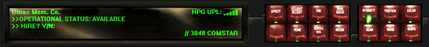

# nicholas_mahan_p1
project 1 - "Foundational Project - ULTRAS Mechwarrior Mercenery Reimbursement System

Flowcharts

**Logical Model**
 

 

**Physical Model**
 

 

**Use Case Diagram**
 

 

**Activity Diagram**
 

 

 As a developer 
 
 I want to create an app that allows user to submit reimbursement forms
 
 so that I can be reimbursed for expendetures for company funtions
 
 Given that sometimes I must spend personal money while directly contributing to company profit
 
 I should not have to come out of pocket while providing such work for my company
 
 I should be refunded all money I spend from personal accounts directly related to company work

 

 
